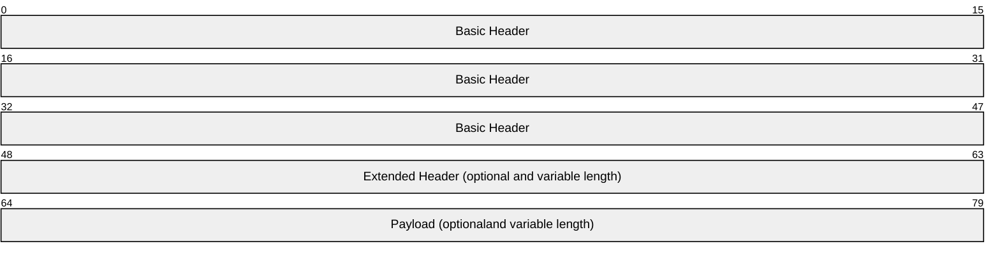
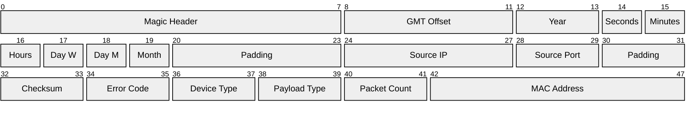
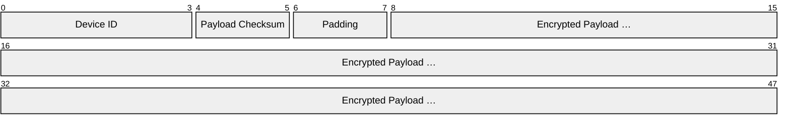
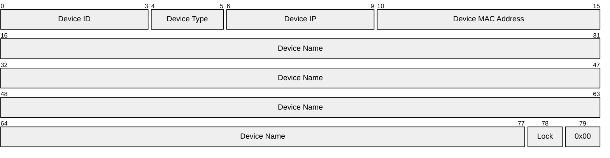
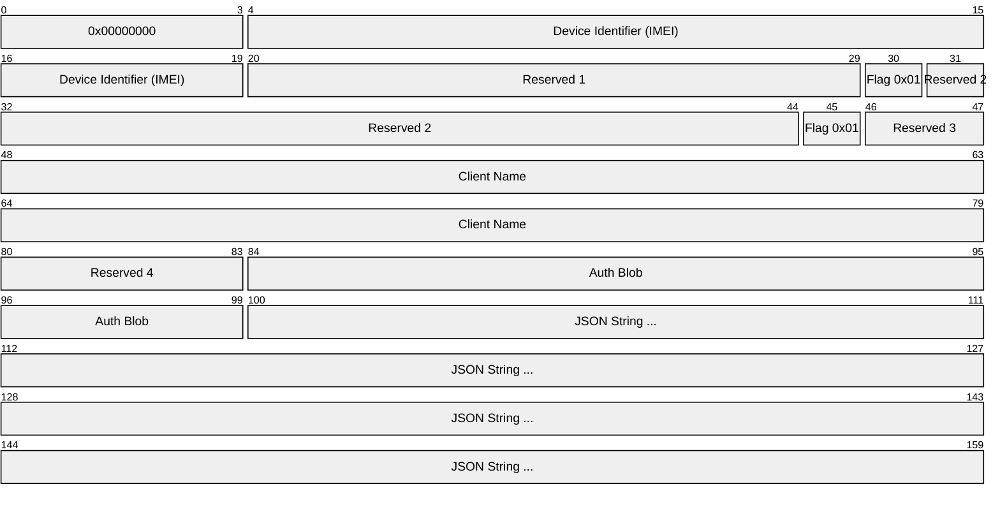
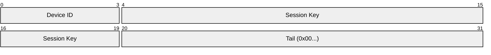

# BroadLink Protocol

BroadLink is a proprietary `UDP`-based protocol used by BroadLink smart home devices (RM series IR blasters, SP series smart plugs, etc.) for local network communication. All packets share a fixed `0x30`-byte binary header, followed by an optional extended header and variable-length payload. Post-authentication traffic is AES-128-CBC encrypted. Interaction sequences are described in [sequences.md](sequences.md).

## References
- [psumdomus: blog-post about the broadlink protocol](https://medium.com/smart-home-diy/broadlink-smart-home-devices-complete-protocol-hack-bc0b4b397af1)
- [mjg59:python-broadlink](https://github.com/mjg59/python-broadlink/) : [protocol.md](https://github.com/mjg59/python-broadlink/blob/master/protocol.md)
- [csabavirag/broadlink-dissector](https://github.com/csabavirag/broadlink-dissector)
- [frawau/aiobroadlink](https://github.com/frawau/aiobroadlink)
- [eschava/broadlink-mqtt](https://github.com/eschava/broadlink-mqtt)
- [momodalo/broadlinkjs](https://github.com/momodalo/broadlinkjs/)
- [felipediel/broadlink-hacktools](https://github.com/felipediel/broadlink-hacktools)


## Broadlink Package

| Header                      | Byte Length        |
|-----------------------------|--------------------|
| Basic Header                | 0x30               | 
| Extended Header (optional)  | 0x00 to ... bytes  |   
| Payload (optional)          | 0x00 to ... bytes  |



## Payload Types
The payload type, indicated by bytes `0x26–0x27` of the [Basic Header](#basic-header), identifies the purpose of each packet. The interaction sequences are described in [sequences.md](sequences.md).

| Payload Type             | Request ID      | Response ID                     |
|--------------------------|-----------------|---------------------------------|
| [`Ping`](#ping)          | `0x0001` (1)    | —                               |
| [`Hello`](#hello)        | `0x0006` (6)    | `0x0007` (7)                    |
| [`Join`](#join)          | `0x0014` (20)   | `0x0015` (21), `0x0398` (920)   |
| [`Discover`](#discover)  | `0x001a` (26)   | `0x001b` (27)                   |
| [`Auth`](#authorization) | `0x0065` (101)  | `0x03e9` (1001)                 |
| [`Command`](#command)    | `0x006a` (106)  | `0x03ee` (1006)                 |

Note the fixed offset of **+**`0x0384` (or **+900**) bewteen command and response code.

### Other - RM5 Plus / RM5+

Observed on an RM5 Plus; purpose not fully documented.

| Request ID       | Response ID        | Description                                                                                                                                   |
|------------------|--------------------|-----------------------------------------------------------------------------------------------------------------------------------------------|
| —                | `0x000e` (14)      | Broadcast-only (Basic Header, no payload), sent **10×** to `255.255.255.255` during WiFi provisioning; possibly a joined announcement.        |
| `0x002a` (42)    | `0x002b` (43)      | Date/time. Response contains: Year (LE uint16), Day of Month, Hours, Minutes, Seconds, and 2 unknown bytes.                                   |
| —                | `0x0398` (920)     | Join error response. Sent by the device when a [Join Request](#join)    is received but the device is already connected to WiFi.              |
| `0x0031` (49)    |                    | Unknown... Lack of response when sending a radom package |
| `0x0037` (55)    |                    | Unknown... Lack of response when sending a radom package |
| `0x0077` (119)   | `0x03fb` (1019)    | Triggers a device reset (even when locked). Device responds **10×**, then reboots.                                                            |
| `0x0078` (120)   | `0x03fc` (1020)    | Response payload is 240 bytes of zeros.                                                                                                       |
| `0x03e7` (999)   | `0x076b` (1899)    | Response contains the device name.                                                                                                            |
| `0x2724` (10020) | `0x2725` (10021)   | Cloud Request (to port 7795 broadlink server) using basic header followed by JSON (starting at 0x30).                                     |

**Cloud Request `0x2724`**

Both type 4 and type 6 messages found.
```{
  "mac": "348e89xxxxxx",
  "header": {
    "type": "6",
    "did": "xxxxxxxxxxxx",
    "pid": "00000000000000000000000024520000",
    "authcode": "0000xxxxxxxxxxxx...",
    "devicetype": "21028"
  },
  "body": "IxFjN+tZ...=="
}
```

**Cloud Response `0x2725`**

Found with `Source IP` (0x18-0x1b): 86.252.87.84
```
{"body":"<base64-encoded-encrypted-body>","mac":"xxxxxxxxxxxx"}
```


### Ping
PayloadType: `0x0001`

Keepalive / heartbeat packet. Only a Basic Header is sent; no payload.


## Encryption

Post-authentication payloads are AES-128-CBC encrypted. All devices share a well-known default key and IV used during provisioning and initial authentication. After a successful [`Auth`](#authorization) handshake the device issues a per-session key that replaces the default for all subsequent [`Command`](#command) packets.

| Parameter   | Value                                       |
|-------------|---------------------------------------------|
| Algorithm   | AES-128-CBC                                 |
| Default Key | `097628343fe99e23765c1513accf8b02`           |
| Default IV  | `562e17996d093d28ddb3ba695a2e6f58`           |

## Basic Header

Fixed length of 0x30 bytes, all Little-Endian:

| Field                  | Start  | End    | Length   | Value                                                        |
|------------------------|--------|--------|----------|--------------------------------------------------------------|
| Magic Header           | 0x00   | 0x07   |  8 Bytes | Fixed: 0x5a 0xa5 0xaa 0x55 0x5a 0xa5 0xaa 0x55               |
| GMT Offset             | 0x08   | 0x0b   |  4 Bytes | GMT offset in whole hours without DST                        |
| Year                   | 0x0c   | 0x0d   |  2 Bytes | Full year, for example 2027                                  |
| Seconds                | 0x0e   | 0x0e   |  1 Byte  | Seconds past the minute (0–59)                               |
| Minutes                | 0x0f   | 0x0f   |  1 Byte  | Minutes past the hour (0–59)                                 |
| Hours                  | 0x10   | 0x10   |  1 Byte  | Hours past midnight (0–23)                                   |
| Day of Week            | 0x11   | 0x11   |  1 Byte  | ISO weekday: Monday = 1, Sunday = 7                          |
| Day of Month           | 0x12   | 0x12   |  1 Byte  | Day of month (1–31)                                          |
| Month                  | 0x13   | 0x13   |  1 Byte  | Month, 1-based (1–12)                                        |
| Padding                | 0x14   | 0x17   |  4 Bytes | Zero-padded                                                  |
| Source IP              | 0x18   | 0x1b   |  4 Bytes | Local IP address, one octet per byte ("Little-Endian")       |
| Source Port            | 0x1c   | 0x1d   |  2 Bytes | LE uint16                                                    |
| Padding                | 0x1e   | 0x1f   |  2 Bytes | Zero-padded                                                  |
| Checksum               | 0x20   | 0x21   |  2 Bytes | LE uint16, checksum over the whole packet; calculated last!  |
| Error Code             | 0x22   | 0x23   |  2 Bytes | LE uint16                                                    |
| [Device Type](/lan-protocol/device-types.md)            | 0x24   | 0x25   |  2 Bytes | LE uint16                                                    |
| Payload Type           | 0x26   | 0x27   |  2 Bytes | LE uint16                                                    |
| Packet Count           | 0x28   | 0x29   |  2 Bytes | LE uint16, idx                                               |
| MAC Address            | 0x2a   | 0x2f   |  6 Bytes | One octet per byte ("Little-Endian")                         |


#### Error Codes

The Error Code field (`0x22–0x23`) is a signed LE int16. A value of `0x0000` means success.

| Code | Description                                    |
|------|------------------------------------------------|
|  `0` | Success                                        |
| `-1` | Authentication failed                          |
| `-2` | You have been logged out                       |
| `-3` | The device is offline                          |
| `-4` | Command not supported                          |
| `-5` | The device storage is full                     |
| `-6` | Structure is abnormal                          |
| `-7` | Control key is expired                         |
| `-8` | Send error                                     |
| `-9` | Write error                                    |
| `-10`| Read error                                     |
| `-11`| SSID could not be found in AP configuration    |


### Payload


### Command Extended Header (0x30–0x37)

Present in all non-hello packets, extend the base 0x30-byte header.

| Field                  | Start  | End    | Length   | Value                                                        |
|------------------------|--------|--------|----------|--------------------------------------------------------------|
| Device ID              | 0x30   | 0x33   |  4 Bytes | Obtained during auth; `0x00000000` before authentication     |
| Payload Checksum       | 0x34   | 0x35   |  2 Bytes | LE uint16, checksum of the unencrypted payload               |
| Padding                | 0x36   | 0x37   |  2 Bytes | Zero-padded                                                  |
| Encrypted Payload      | 0x38   | …      | Variable | AES-128-CBC encrypted payload                                |



### Hello
PayloadType: `0x0006` | `0x0007`

Used to discover Broadlink devices on the local network. Sent as a **UDP broadcast** to `255.255.255.255:80`. No extended header, no payload in the request — only the base 0x30-byte header.

#### Hello Response Payload (0x50 bytes, offsets relative to payload start)

| Field        | Start  | End    | Length   | Value                                                     |
|--------------|--------|--------|----------|-----------------------------------------------------------|
| Device ID    | 0x00   | 0x03   |  4 Bytes | LE uint32 — unique device identifier                      |
| Device Type  | 0x04   | 0x05   |  2 Bytes | LE uint16 — see Device Type table                         |
| Device IP    | 0x06   | 0x09   |  4 Bytes | Reversed byte order (last octet first)                    |
| MAC Address  | 0x0a   | 0x0f   |  6 Bytes | One octet per byte                                        |
| Device Name  | 0x10   | 0x4d   | 60 Bytes | UTF-8 string, null-terminated                             |
| Unknown      | 0x4e   | 0x4e   |  1 Byte  |                                                           |
| Lock Status  | 0x4f   | 0x4f   |  1 Byte  | `0x00` = unlocked, `0x01` = locked                        |



---

### `Discover` 
PayloadType: `0x001a` / `0x001b`

Used while the device is in **AP mode** to scan for available WiFi networks. No payload in the request.

#### Discover Response Payload (offsets relative to payload start)

| Field            | Start  | End    | Length   | Value                                                   |
|------------------|--------|--------|----------|---------------------------------------------------------|
| Network Count    | 0x00   | 0x00   |  1 Byte  | Number of networks found                                |
| Padding          | 0x01   | 0x03   |  3 Bytes | `0x00`                                                  |
| Networks         | 0x04   | …      | Variable | Array of 64-byte network entries (see below)            |

Each 64-byte network entry:

| Field            | Start  | End    | Length   | Value                                                   |
|------------------|--------|--------|----------|---------------------------------------------------------|
| SSID             | 0x00   | 0x1f   | 32 Bytes | ASCII string                                            |
| SSID Length      | 0x24   | 0x24   |  1 Byte  |                                                         |
| Encryption Type  | 0x30   | 0x30   |  1 Byte  | `0x00`=none, `0x01`=WEP, `0x02`=WPA1, `0x03`=WPA2, `0x04`=WPA1/2 |

---

### `Join` 
PayloadType: `0x0014` / `0x0015`

Used while the device is in **AP mode** to provision WiFi credentials. Response is an empty ACK.

#### Join Request (`0x0014`)
(128 bytes, offsets relative to payload start)

| Field            | Start  | End    | Length   | Value                                                   |
|------------------|--------|--------|----------|---------------------------------------------------------|
| Padding          | 0x30   | 0x43   |          | `0x00`                                                  |
| SSID             | 0x44   | 0x63   | 32 Bytes | ASCII string (zero-padded)                              |
| Password         | 0x64   | 0x83   | 32 Bytes | ASCII string (zero-padded)                              |
| SSID Length      | 0x84   | 0x84   |  1 Byte  |                                                         |
| Password Length  | 0x85   | 0x85   |  1 Byte  |                                                         |
| Security Mode    | 0x86   | 0x86   |  1 Byte  | `0x00`=none, `0x01`=WEP, `0x02`=WPA1, `0x03`=WPA2, `0x04`=WPA1/2 |
| Padding          | 0x87   | 0x87   |  1 Byte  | `0x00`                                                  |


#### Join Response (`0x0015`)

[Basic Header](#basic-header) followed (starting ar 0x30) with an encrypted payloas using the **default** AES-128-CBC key and IV (same as [`Auth`](#authorization)). Decrypts to a JSON status blob.

##### Payload (decrypted, from 0x30)

| JSON Field | Type   | Description                                      |
|------------|--------|--------------------------------------------------|
| `hw`       | string | Hardware platform (e.g. `"rtl8720"`)             |
| `ver`      | number | Firmware version                                 |
| `svn`      | number | SVN build revision                               |
| `buildtime`| string | Build timestamp                                  |
| `pid`      | number | Product ID                                       |
| `did`      | string | Device ID / MAC address                          |
| `uptime`   | number | Seconds since last reboot                        |
| `ssid`     | string | Connected WiFi SSID (empty if not connected)     |
| `bssid`    | string | Connected WiFi BSSID (`"000000000000"` if none)  |
| `rssi`     | number | WiFi signal strength (dBm, negative; `0` if none)|
| `devkey`   | string | Device key (hex, 16 bytes)                       |


---

### `Authorization`

Auth request (`0x65`) and response (`0x3e9`) use the **default** AES-128-CBC key and IV.
 
- key = 09 76 28 34 3f e9 9e 23 76 5c 15 13 ac cf 8b 02
- iv = 56 2e 17 99 6d 09 3d 28 dd b3 ba 69 5a 2e 6f 58

#### Auth Request Payload (decrypted, from 0x38)


| Field                  | Start  | End    | Length   | Value                                                       |
|------------------------|--------|--------|----------|-------------------------------------------------------------|
| Reserved 0             | 0x00   | 0x03   |  4 Bytes | `0x00000000`                                                |
| Device Identifier      | 0x04   | 0x13   | 16 Bytes | 16-digit device identifier (e.g. IMEI)                      |
| Reserved 1             | 0x14   | 0x1d   | 10 Bytes | `0x00...`                                                   |
| Flag                   | 0x1e   | 0x1e   |  1 Byte  | `0x01`                                                      |
| Reserved 2             | 0x1f   | 0x2c   | 14 Bytes | `0x00...`                                                   |
| Flag 2                 | 0x2d   | 0x2d   |  1 Byte  | `0x01`                                                      |
| Reserved 3             | 0x2e   | 0x2f   |  2 Bytes | `0x00...`                                                   |
| Client Name            | 0x30   | 0x4f   | 32 Bytes | NULL-terminated ASCII string (zero-padded)                  |
| Reserved 4             | 0x50   | 0x53   |  4 Bytes | `0x00...`                                                   |
| Auth Blob              | 0x54   | 0x63   | 16 Bytes |                                                             |
| Metadata JSON          | 0x64   | …      | Variable | JSON string (see example below)                             |



#### Example JSON 
When using Device Type: 0x5224 → RM5 Pro, in europ, the BroadLink-app supplid the following localized severs to the Broadlink Device.

```
{
    "tcp": "device-heartbeat-deu-6dc239d5.ibroadlink.com",
    "http": "device-gateway-deu-6dc239d5.ibroadlink.com",
    "companyid": "5eda600025ae5057181daaa2124f79b7"
}
```

88478	2026-04-13 21:08:10.658505	192.168.10.100	192.168.10.1	DNS	85	Standard query 0x2c3f HTTPS 


<!-- Other domains found:
- app-service-deu-81f3c7fd.ibroadlink.com
- device-heartbeat-deu-6dc239d5.ibroadlink.com
- device-gateway-deu-6dc239d5.ibroadlink.com
- device-heartbeat-deu-6dc239d5.ibroadlink.com
- [app-service-deu-6dc239d5.ibroadlink.com](https://app-service-deu-6dc239d5.ibroadlink.com/appfront/v1/webui/app-h5-help_and_feedback-1209/?language=en-us&nightMode=false&origin=copy&lid=5eda600025ae5057181daaa2124f79b7#)
- [cloud-oauth-deu-6dc239d5.ibroadlink.com](https://cloud-oauth-deu-6dc239d5.ibroadlink.com/app-h5-oauth-ihc-for-eu-1598/login.html) -->

#### Auth Response Payload (decrypted, from 0x38)

| Field                  | Start  | End    | Length   | Value                                                       |
|------------------------|--------|--------|----------|-------------------------------------------------------------|
| Device ID              | 0x00   | 0x03   |  4 Bytes | Assigned device ID; store for future packets (e.g. `0x00000001`)               |
| Encryption Key         | 0x04   | 0x13   | 16 Bytes | AES key for all subsequent communication                    |
| Tail Padding           | 0x14   | 0x1f   | 12 Bytes |




### `Command`
PayloadType: `0x006a` | `0x03ee`  


The structure of the decrypted `Command` payload (decrypted, from `0x38...`) differs between device generations.

[Basic Header](#basic-header)


| Field                  | Start  | End    | Length   | Value                                                             |
|------------------------|--------|--------|----------|-------------------------------------------------------------------|
| Device ID              | 0x30   | 0x33   |  4 Bytes | Obtained during authentication, 0x00 before authentication)       |
| Checksum               | 0x34   | 0x35   |  2 Bytes | Checksum of unencrypted payload as a little-endian 16 bit integer |
| Padding                | 0x36   | 0x37   |  2 Bytes | 0x0000                                                            |

#### Classic (RM2/RM3/SP1/SP2)

| Field                  | Start  | End  | Length   | Value                     |
|------------------------|--------|------|----------|---------------------------|
| Subcommand             | 0x38   | 0x38 | 1 Byte   | Identifies the operation  |
| Data                   | 0x39   | …    | Variable | Command-specific data     |


#### New (RM3*, RM4 and RM5)

Offsets relative to start of decrypted payload:

| Field                  | Start  | End  | Length   | Value                                |
|------------------------|--------|------|----------|--------------------------------------|
| Length                 | 0x00   | 0x01 | 2 Bytes  | LE uint16 — length of data field     |
| Command                | 0x02   | 0x03 | 2 Bytes  | LE uint16 — identifies the operation |
| Data                   | 0x04   | …    | Variable | Command-specific data                |


#### Command Request (`0x006a`)
Device specific...

#### Command Response (`0x03ee`)
Device specific...

---

## RM Flows

#### Learning Mode

##### Entering Learning Mode
Send the following 16 byte `Request` payload with a command value of 0x006a:

Offset|Contents|
|------|--------|
|0x00|0x03|
|0x01-0x0f|0x00|

##### Reading back data from learning mode
------------------------------------

Send the following 16 byte payload with a command value of 0x006a:

|Offset|Contents|
|------|--------|
|0x00|0x04|
|0x01-0x0f|0x00|

Byte 0x22 of the response contains a little-endian 16 bit error code. If this is 0, a code has been obtained. Bytes 0x38 and onward of the response are encrypted. Decrypt them. Bytes 0x04 and onward of the decrypted payload contain the captured data.

#### Sending IR/RF Data

Send the following `Request` (0x006a) payload:


|Offset|Contents|
|------|--------|
|0x00|0x02| 
|0x01-0x03|0x00|
|0x04|0x26 = IR, 0xb2 for RF 433Mhz, 0xd7 for RF 315Mhz|
|0x05|repeat count, (0 = no repeat, 1 send twice, .....)|
|0x06-0x07|Length of the following data in little endian|
|0x08 ....|Pulse lengths in 2^-15 s units (µs * 269 / 8192 works very well)|
|....|For IR codes, the pulse lengths should be paired as ON, OFF|

New:
|Offset|Contents|
|---------|--------|
|0x00-0x01| Inner Length |
|0x02-0x05| Subcommand (2  = send_data)
|0x06     | Signal Type: 0x26 = IR, 0xb2 for RF 433Mhz, 0xd7 for RF 315Mhz|
|0x07     | Repeat count, (0 = no repeat, 1 send twice, ...)|
|0x08-0x09|Length of the following data in little endian|
|0x10-0x12| Extended timing value
00           trailing byte
00 ...       AES padding

32.84 µs ticks

Each value is represented by one byte. If the length exceeds one byte
then it is stored big endian with a leading 0.

Captures of IR codes from the device will always end with a constant OFF value of `0x00 0x0d 0x05` but the trailing silence can be anything on transmit. The likely reason for this value is a capped timeout value on detection. The value is about 102 milliseconds.

Example: The header for my Optoma projector is 8920 4450  
8920 * 269 / 8192 = 0x124  
4450 * 269 / 8192 = 0x92  

So the data starts with `0x00 0x1 0x24 0x92 ....`

#### Delete? `0x68`
Command Code: 0x006a (Command Request)
Decrypted: 68000000000000000000000000000000

Command Code: 0x03ee (Command Response)
Decrypted: 680000009FF200009FF200000000000030F20000000000000000000000000000


## Apps

### iOS/iPadOS

- e-Control: Seems not the be compatible with RM devices. It's using port 15000 for WiFi pairing message with the credentials, also package stucture differs.
- Broadlink: Uses Bluetooth to transfer WiFi credentials.
- NoApp: Unclear as login is required, does send out Hello Request's (Command Code: 0x0006).
- ihc for EU: Unclear as login is required, does send out Hello Request's (Command Code: 0x0006).
