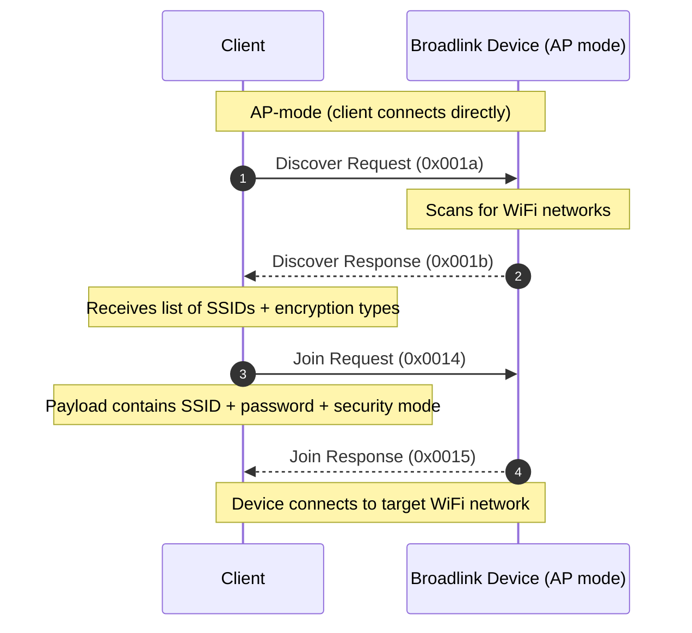
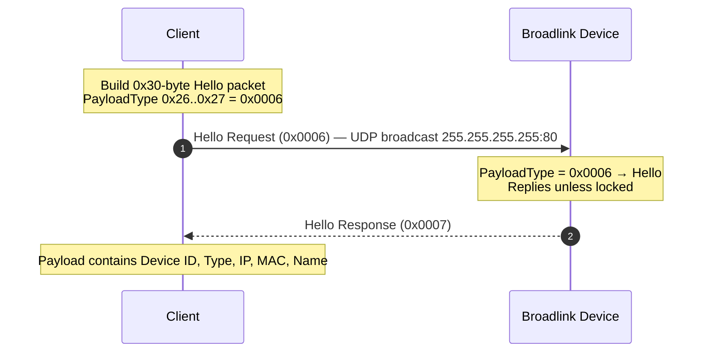
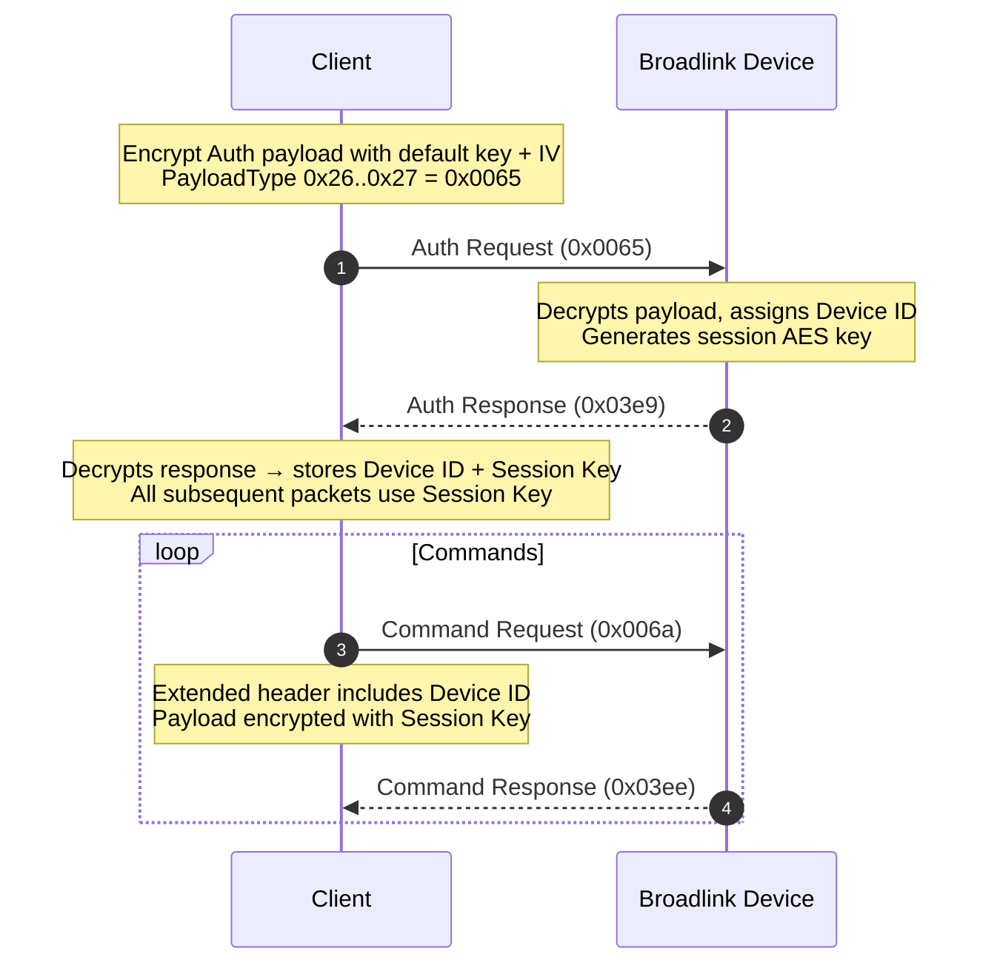
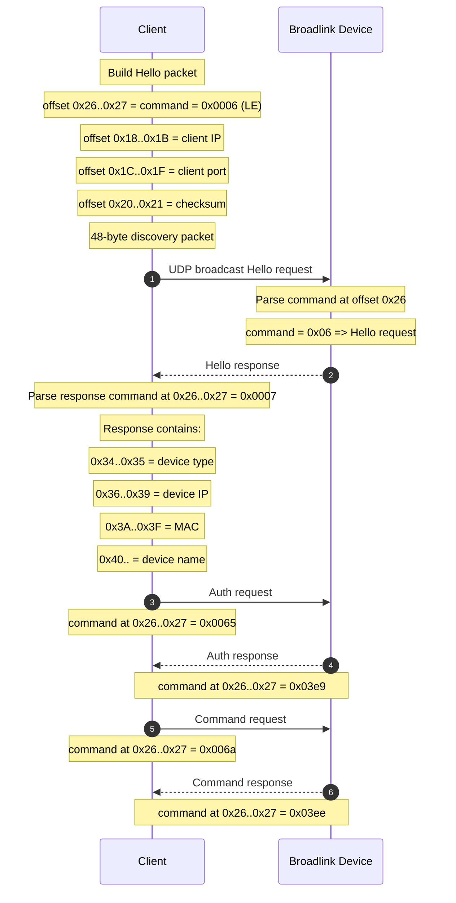
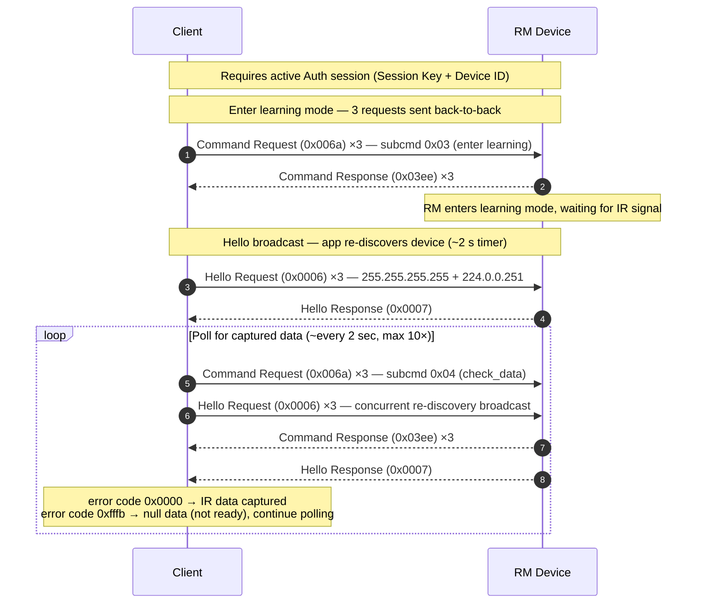
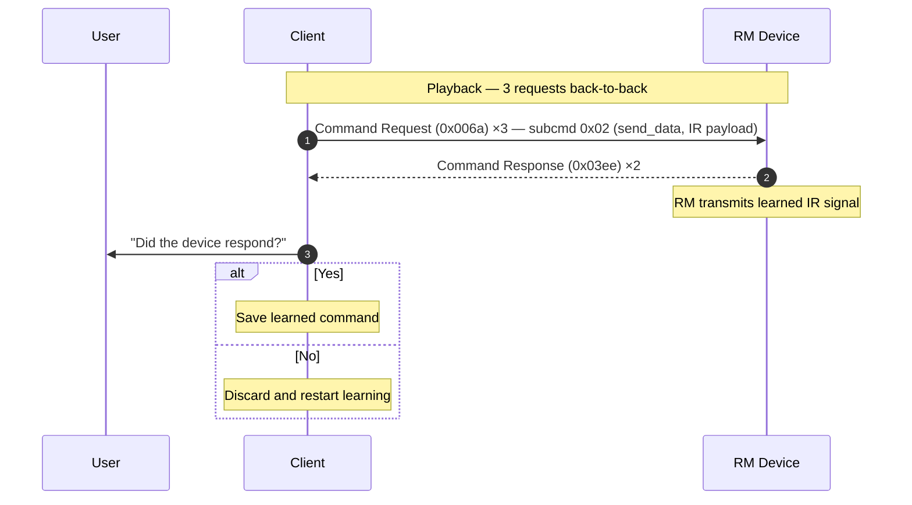

# Sequences

The protocol lifecycle follows three phases:
1. [**Provisioning**](#provisioning) — device is in AP mode; the host scans for WiFi networks (`Discover`) and sends credentials (`Join`).
2. [**Discovery**](#discovery) — the host broadcasts a `Hello` packet to find devices on the local network.
3. [**Control**](#control) — the host authenticates (`Auth`orization) to obtain a session key and device ID, then issues `Command` packets.

## Provisioning

Device is in **AP mode**. The client connects to the device's own WiFi network and performs WiFi provisioning.

## Discovery

The client sends a `Hello` packet to locate BroadLink devices on the local network; the device replies with its identity and network info. The packet is typically broadcast to `255.255.255.255:80`, and some clients additionally send it in parallel to `224.0.0.251:80` and `224.0.0.251:16680` — the mDNS multicast group — presumably to avoid it being dropped by routers that filter directed broadcasts. `Authenticated` and `Locked` devices may not respond to multicast and require a directed broadcast or unicast to their known IP.

To unlock a BroadLink device (RM4/RM Pro), open the BroadLink-app, select the device, tap the top-right menu (...) -> "Property", and toggle "Lock device" to OFF.

## Control

After discovery the client authenticates to obtain a session key and device ID, then issues encrypted commands.

## Example

## RM Learn Command (checked with RM5+)

Puts the RM device into IR learning mode and polls until a code is captured (max 30 seconds).

Three requests are sent back-to-back for every command type. On a successful `check_data` (error `0x0000`) the response payload is 180 bytes (vs. 100 for an error), containing the captured IR data. The two trailing responses to the duplicate requests carry error `0xfffb` (null data / not yet captured). Hello broadcasts run on a ~2 s timer concurrently with the polling.

Once the IR data is captured, the app does two more Hello broadcast rounds before playing back the learned signal:

