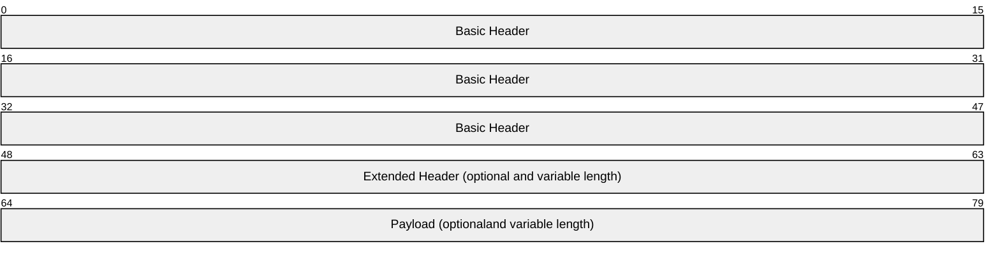
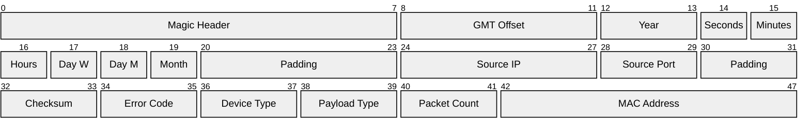
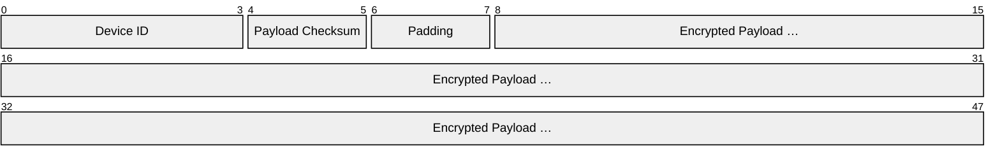
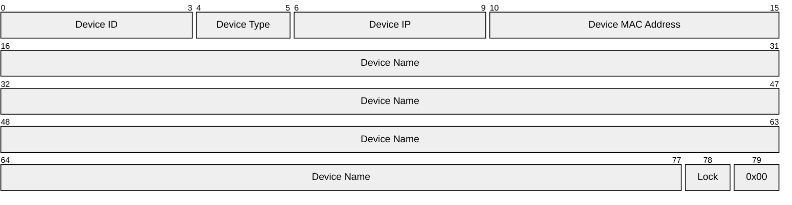
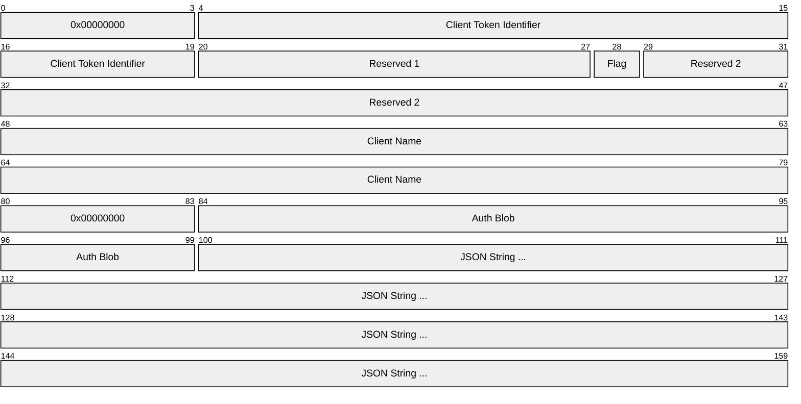
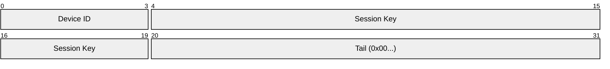

# BroadLink Protocol

BroadLink is a proprietary `UDP`-based protocol used by BroadLink smart home devices (RM series IR blasters, SP series smart plugs, etc.) for local network communication. All packets share a fixed `0x30`-byte binary header, followed by an optional extended header and variable-length payload. Post-authentication traffic is AES-128-CBC encrypted. Interaction sequences are described in [sequences.md](sequences.md).

## References
- [psumdomus blog-post](https://medium.com/smart-home-diy/broadlink-smart-home-devices-complete-protocol-hack-bc0b4b397af1)
- [mjg59/python-broadlink](https://github.com/mjg59/python-broadlink/) : [protocol.md](https://github.com/mjg59/python-broadlink/blob/master/protocol.md)
- [csabavirag/broadlink-dissector](https://github.com/csabavirag/broadlink-dissector)
- [aiobroadlink](https://github.com/frawau/aiobroadlink)
- [eschava/broadlink-mqtt](https://github.com/eschava/broadlink-mqtt)
- [momodalo/broadlinkjs](https://github.com/momodalo/broadlinkjs/)


## Broadlink Package

| Header                      | Byte Length        |
|-----------------------------|--------------------|
| Basic Header                | 0x30               | 
| Extended Header (optional)  | 0x00 to ... bytes  |   
| Payload (optional)          | 0x00 to ... bytes  |



## Payload Types
The payload type, indicated by bytes `0x26–0x27` of the [Basic Header](#basic-header), identifies the purpose of each packet. The interaction sequences are described in [sequences.md](sequences.md).

| Payload Type             | Request ID | Response ID |
|--------------------------|------------|-------------|
| [`Hello`](#hello)        | `0x0006`   | `0x0007`    |
| [`Discover`](#discover)  | `0x001a`   | `0x001b`    |
| [`Join`](#join)          | `0x0014`   | `0x0015`    |
| [`Auth`](#authorization) | `0x0065`   | `0x03e9`    |
| [`Command`](#command)    | `0x006a`   | `0x03ee`    |


## Basic Header

Fixed length of 0x30 bytes, all Little-Endian:

| Field                  | Start  | End    | Length   | Value                                                        |
|------------------------|--------|--------|----------|--------------------------------------------------------------|
| Magic Header           | 0x00   | 0x07   |  8 Bytes | Fixed: 0x5a 0xa5 0xaa 0x55 0x5a 0xa5 0xaa 0x55               |
| GMT Offset             | 0x08   | 0x0b   |  4 Bytes | GMT offset in whole hours without DST                        |
| Year                   | 0x0c   | 0x0d   |  2 Bytes | Full year, for example 2027                                  |
| Seconds                | 0x0e   | 0x0e   |  1 Byte  | Seconds past the minute (0–59)                               |
| Minutes                | 0x0f   | 0x0f   |  1 Byte  | Minutes past the hour (0–59)                                 |
| Hours                  | 0x10   | 0x10   |  1 Byte  | Hours past midnight (0–23)                                   |
| Day of Week            | 0x11   | 0x11   |  1 Byte  | ISO weekday: Monday = 1, Sunday = 7                          |
| Day of Month           | 0x12   | 0x12   |  1 Byte  | Day of month (1–31)                                          |
| Month                  | 0x13   | 0x13   |  1 Byte  | Month, 1-based (1–12)                                        |
| Padding                | 0x14   | 0x17   |  4 Bytes | Zero-padded                                                  |
| Source IP              | 0x18   | 0x1b   |  4 Bytes | Local IP address, one octet per byte ("Little-Endian")       |
| Source Port            | 0x1c   | 0x1d   |  2 Bytes | LE uint16                                                    |
| Padding                | 0x1e   | 0x1f   |  2 Bytes | Zero-padded                                                  |
| Checksum               | 0x20   | 0x21   |  2 Bytes | LE uint16, checksum over the whole packet; calculated last   |
| Error Code             | 0x22   | 0x23   |  2 Bytes | LE uint16                                                    |
| Device Type            | 0x24   | 0x25   |  2 Bytes | LE uint16                                                    |
| Payload Type           | 0x26   | 0x27   |  2 Bytes | LE uint16                                                    |
| Packet Count           | 0x28   | 0x29   |  2 Bytes | LE uint16, idx                                               |
| MAC Address            | 0x2a   | 0x2f   |  6 Bytes | One octet per byte ("Little-Endian")                         |




### Payload


### Command Extended Header (0x30–0x37)

Present in all non-hello packets, extend the base 0x30-byte header.

| Field                  | Start  | End    | Length   | Value                                                        |
|------------------------|--------|--------|----------|--------------------------------------------------------------|
| Device ID              | 0x30   | 0x33   |  4 Bytes | Obtained during auth; `0x00000000` before authentication     |
| Payload Checksum       | 0x34   | 0x35   |  2 Bytes | LE uint16, checksum of the unencrypted payload               |
| Padding                | 0x36   | 0x37   |  2 Bytes | Zero-padded                                                  |
| Encrypted Payload      | 0x38   | …      | Variable | AES-128-CBC encrypted payload                                |



### Hello
PayloadType: `0x0006` | `0x0007`

Used to discover Broadlink devices on the local network. Sent as a **UDP broadcast** to `255.255.255.255:80`. No extended header, no payload in the request — only the base 0x30-byte header.

#### Hello Response Payload (0x50 bytes, offsets relative to payload start)

| Field        | Start  | End    | Length   | Value                                                     |
|--------------|--------|--------|----------|-----------------------------------------------------------|
| Device ID    | 0x00   | 0x03   |  4 Bytes | LE uint32 — unique device identifier                      |
| Device Type  | 0x04   | 0x05   |  2 Bytes | LE uint16 — see Device Type table                         |
| Device IP    | 0x06   | 0x09   |  4 Bytes | Reversed byte order (last octet first)                    |
| MAC Address  | 0x0a   | 0x0f   |  6 Bytes | One octet per byte                                        |
| Device Name  | 0x10   | 0x4d   | 60 Bytes | UTF-8 string, null-terminated                             |
| Lock Status  | 0x4e   | 0x4e   |  1 Byte  | `0x00` = unlocked, `0x01` = locked                        |
| Padding      | 0x4f   | 0x4f   |  1 Byte  | `0x00`                                                    |



---

### `Discover` 
PayloadType: `0x001a` / `0x001b`

Used while the device is in **AP mode** to scan for available WiFi networks. No payload in the request.

#### Discover Response Payload (offsets relative to payload start)

| Field            | Start  | End    | Length   | Value                                                   |
|------------------|--------|--------|----------|---------------------------------------------------------|
| Network Count    | 0x00   | 0x00   |  1 Byte  | Number of networks found                                |
| Padding          | 0x01   | 0x03   |  3 Bytes | `0x00`                                                  |
| Networks         | 0x04   | …      | Variable | Array of 64-byte network entries (see below)            |

Each 64-byte network entry:

| Field            | Start  | End    | Length   | Value                                                   |
|------------------|--------|--------|----------|---------------------------------------------------------|
| SSID             | 0x00   | 0x1f   | 32 Bytes | ASCII string                                            |
| SSID Length      | 0x24   | 0x24   |  1 Byte  |                                                         |
| Encryption Type  | 0x30   | 0x30   |  1 Byte  | `0x00`=none, `0x01`=WEP, `0x02`=WPA1, `0x03`=WPA2, `0x04`=WPA1/2 |

---

### `Join` 
PayloadType: `0x0014` / `0x0015`

Used while the device is in **AP mode** to provision WiFi credentials. Response is an empty ACK.

#### Join Request Payload (128 bytes, offsets relative to payload start)

| Field            | Start  | End    | Length   | Value                                                   |
|------------------|--------|--------|----------|---------------------------------------------------------|
| Padding          | 0x00   | 0x3b   | 60 Bytes | `0x00`                                                  |
| SSID             | 0x3c   | 0x5b   | 32 Bytes | ASCII string (zero-padded)                              |
| Password         | 0x5c   | 0x7b   | 32 Bytes | ASCII string (zero-padded)                              |
| SSID Length      | 0x7c   | 0x7c   |  1 Byte  |                                                         |
| Password Length  | 0x7d   | 0x7d   |  1 Byte  |                                                         |
| Security Mode    | 0x7e   | 0x7e   |  1 Byte  | `0x00`=none, `0x01`=WEP, `0x02`=WPA1, `0x03`=WPA2, `0x04`=WPA1/2 |
| Padding          | 0x7f   | 0x7f   |  1 Byte  | `0x00`                                                  |

---

### `Authorization`

Auth request (`0x65`) and response (`0x3e9`) use the **default** AES-128-CBC key and IV.
 
- key = 09 76 28 34 3f e9 9e 23 76 5c 15 13 ac cf 8b 02
- iv = 56 2e 17 99 6d 09 3d 28 dd b3 ba 69 5a 2e 6f 58

#### Auth Request Payload (decrypted, from 0x38)


| Field                  | Start  | End    | Length   | Value                                                       |
|------------------------|--------|--------|----------|-------------------------------------------------------------|
| Reserved 0             | 0x00   | 0x03   |  4 Bytes | `0x00000000`                                                |
| Device Identifier      | 0x04   | 0x13   | 16 Bytes | 16-digit device identifier (e.g. IMEI)                      |
| Reserved 1             | 0x14   | 0x1b   |  8 Bytes | `0x00...`                                                   |
| Flag                   | 0x1c   | 0x1c   |  1 Byte  | `0x01`                                                      |
| Reserved 2             | 0x1d   | 0x2f   | 19 Bytes | `0x000000`                                                  |
| Client Name            | 0x30   | 0x4f   | 32 Bytes | NULL-terminated ASCII string (zero-padded)                  |
| Reserved 3             | 0x50   | 0x53   |  4 Bytes | `0x00...`                                                   |
| Auth Blob              | 0x54   | 0x63   | 16 Bytes |                                                             |
| Metadata JSON          | 0x64   | …      | Variable | JSON string                                                 |



#### Example JSON 
When using Device Type: 0x5224 → RM5 Pro, in europ, the BroadLink-app supplid the following localized severs to the Broadlink Device.

```
{
    "tcp": "device-heartbeat-deu-6dc239d5.ibroadlink.com",
    "http": "device-gateway-deu-6dc239d5.ibroadlink.com",
    "companyid": "5eda600025ae5057181daaa2124f79b7"
}
```

<!-- Other domains found:
- device-heartbeat-deu-6dc239d5.ibroadlink.com
- device-gateway-deu-6dc239d5.ibroadlink.com
- device-heartbeat-deu-6dc239d5.ibroadlink.com
- [app-service-deu-6dc239d5.ibroadlink.com](https://app-service-deu-6dc239d5.ibroadlink.com/appfront/v1/webui/app-h5-help_and_feedback-1209/?language=en-us&nightMode=false&origin=copy&lid=5eda600025ae5057181daaa2124f79b7#)
- [cloud-oauth-deu-6dc239d5.ibroadlink.com](https://cloud-oauth-deu-6dc239d5.ibroadlink.com/app-h5-oauth-ihc-for-eu-1598/login.html) -->

#### Auth Response Payload (decrypted, from 0x38)

| Field                  | Start  | End    | Length   | Value                                                       |
|------------------------|--------|--------|----------|-------------------------------------------------------------|
| Device ID              | 0x00   | 0x03   |  4 Bytes | Assigned device ID; store for future packets (e.g. `0x00000001`)               |
| Encryption Key         | 0x04   | 0x13   | 16 Bytes | AES key for all subsequent communication                    |
| Tail Padding         | 0x14   | 0x1f   | 12 Bytes |




### `Command`
PayloadType: `0x006a` | `0x03ee`  

The structure of the decrypted `Command` payload (decrypted, from `0x38...`) differs between device generations.

#### Classic (RM2/RM3/SP1/SP2)

| Field       | Start | End  | Length   | Value                     |
|-------------|-------|------|----------|---------------------------|
| Subcommand  | 0x00  | 0x00 | 1 Byte   | Identifies the operation  |
| Data        | 0x01  | …    | Variable | Command-specific data     |

#### New (RM4/MP1)

| Field    | Start | End  | Length  | Value                                |
|----------|-------|------|---------|--------------------------------------|
| Length   | 0x00  | 0x01 | 2 Bytes | LE uint16 — length of data field     |
| Command  | 0x02  | 0x05 | 4 Bytes | LE uint32 — identifies the operation |
| Data     | 0x06  | …    | Variable | Command-specific data               |
